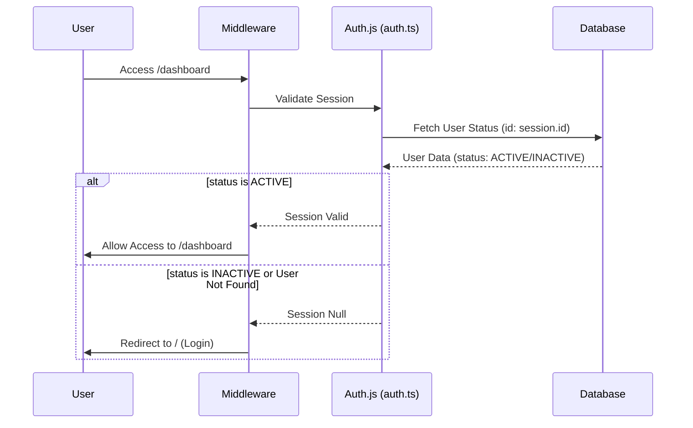
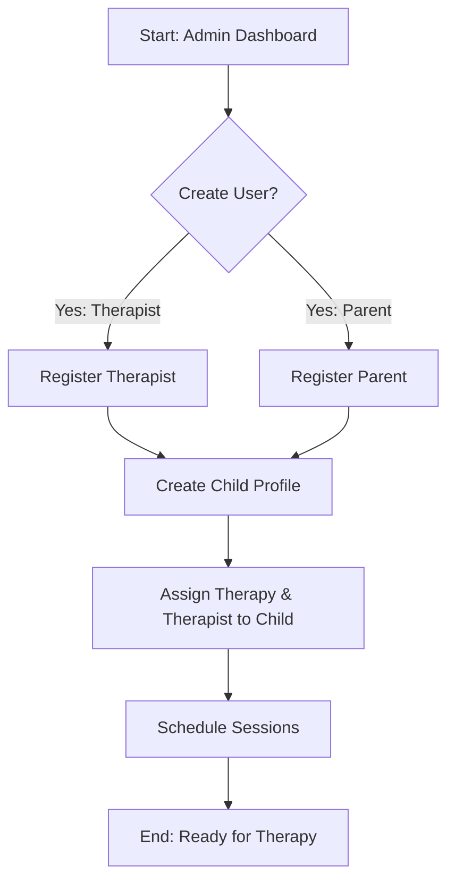
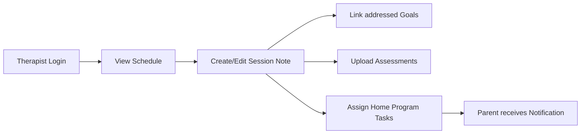
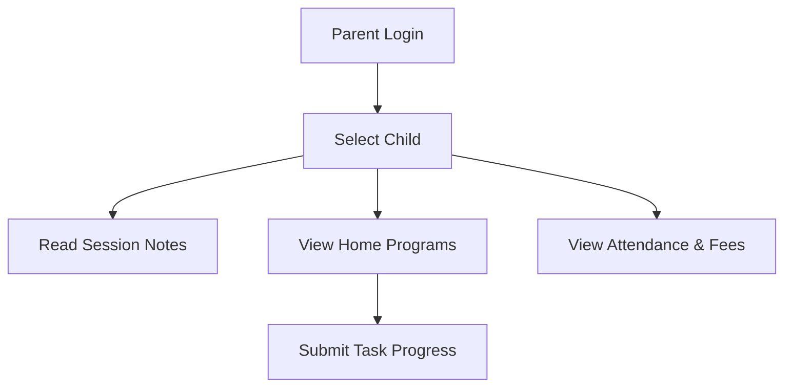

# Wonderbees Therapy Centre App - User Flows (Developer Edition)

This document outlines the core user journeys within the application, visualizing how different roles interact with the system architecture.

## 1. Authentication & Security Flow
This flow is critical as it includes the real-time status check and role-based redirection.



## 2. Admin: Onboarding Flow
The Admin is responsible for setting up the ecosystem for a child.



## 3. Therapist: Daily Workflow
Focuses on clinical documentation and home program management.



## 4. Parent: Involvement Flow
Focuses on tracking progress and implementing home programs.



## 5. System: Role-Based Redirection (`/dashboard`)
How the application decides which dashboard to render.

```mermaid
flowchart TD
    Start([User hits /dashboard]) --> Auth[auth() call in dashboard/page.tsx]
    Auth --> Session{Is Logged In?}
    Session -- No --> RedirectRoot[Redirect to /]
    Session -- Yes --> Role{User Role?}
    
    Role -- ADMIN --> AdminComp[Render <AdminDashboard />]
    Role -- THERAPIST --> StaffComp[Render <StaffDashboard />]
    Role -- PARENT --> ParentComp[Render <ParentDashboard />]
    Role -- UNKNOWN --> RedirectRoot
```

---

### Implementation Notes for Developers
- **Middleware**: Defined in `middleware.ts`, it protects routes by checking the `authorized` callback in `auth.config.ts`.
- **Database Consistency**: The `session` callback in `auth.ts` is the point of truth for user status. Returning `null` there forces a logout across the app.
- **Server Actions**: All user actions (creating notes, updating status) should be performed via Server Actions in `lib/actions.ts` to ensure type safety and error handling.
- **Revalidation**: Use `revalidatePath` after data mutations to ensure the UI reflects the latest database state without a manual refresh.
